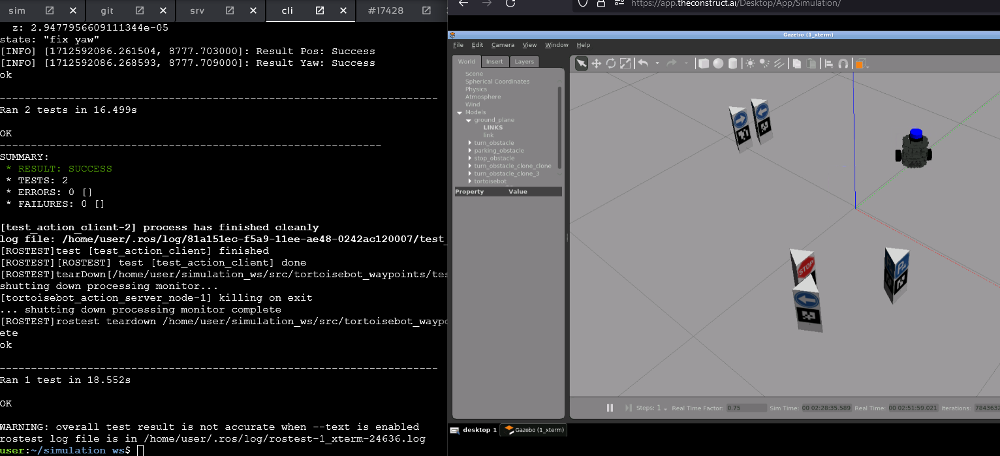
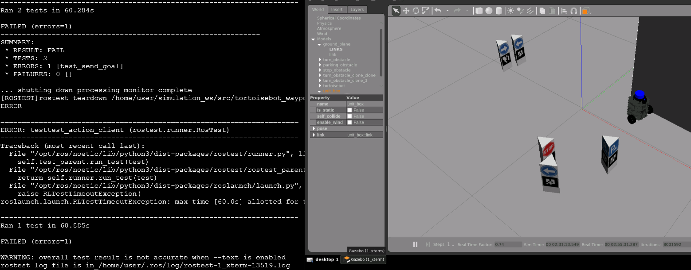

# tortoisebot_ros1_test

## Simulation
**start**
```shell
source ~/simulation_ws/devel/setup.bash
roslaunch tortoisebot_gazebo tortoisebot_playground.launch
```

**reset**
```shell
rosservice call /gazebo/reset_world "{}"
```

## Action
**compile**
```shell
cd simulation_ws/;catkin_make;source devel/setup.bash
```

**start server**
```shell
source ~/simulation_ws/devel/setup.bash
rosrun tortoisebot_waypoints tortoisebot_action_server.py
```

**run client**
```shell
source ~/simulation_ws/devel/setup.bash
rosrun tortoisebot_waypoints exp_action_client.py
```

## TEST
build
```shell
cd simulation_ws/;catkin_make;source devel/setup.bash
```
run test
```shell
cd simulation_ws/;catkin_make run_tests
```
launch test
```
rostest tortoisebot_waypoints TEST_FILE --reuse-master
```
check summary
```shell
colcon test-result --test-result-base build/tortoisebot_waypoints
```
clean tests
```
rm -r ~/ros2_ws/build/tortoisebot_waypoints/test_results
rm -r ~/ros2_ws/build/tortoisebot_waypoints/Testing
```

## RESULTS
> **test-pass:** 
tests pass correctly if the goal is reached before and before timeout


> **test-fail:** 
tests don't pass correctly if the goal is not reached or due to timeout

